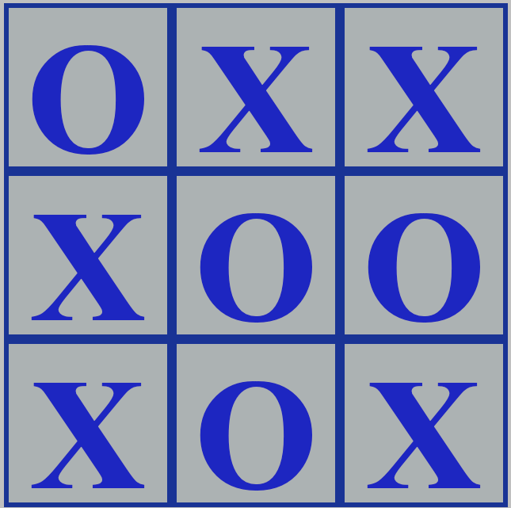
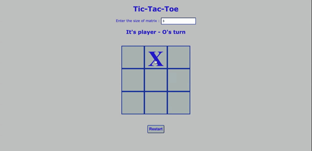

# tic-tac-toe
Its a famous game played by two players and the one who completes straight X or O in any direction of the given matrix wins.

**tic-tac-toe**

## Description
- Its a famous game played by two players on the chosen matrix.
- One represents X and the other represents O.
- They play in strict alternative turns and put their chosen sign on the given matrix cell.
- It continues until the one who complete their sign as straight line in any direction (horizontal,vertical or diagonal).
- Otherwise the game completes with draw as no one could complete but the cells in the matrix are filled up already.

### 

## Challenges and What I learned
- I converted the basic 3X3 tic-tac-toe to a dynamic one. So based on user input it will create 4X4 / 5X5 or any size.
- How to create a dynamic grid and making it clickable.
- Displaying the player sign on the grid.
- Showing the status of the game (win / draw / who won / whose turn it is)
- How to restart the entire game for the same martix size.
- Dynamic two dimentional array handling and interactions with DOM.

## Installation
git clone https://github.com/vanisbala/tic-tac-toe

## Built with
- [HTML](https://developer.mozilla.org/en-US/docs/Web/HTML)
- [CSS](https://developer.mozilla.org/en-US/docs/Web/CSS)
- [JavaScript](https://developer.mozilla.org/en-US/docs/Web/Javascript)

## Deployed Link
- [See live Site]( https://vanisbala.github.io/tic-tac-toe/)

## Author
### Vani 
- [Link to Github](https://github.com/vanisbala)

## Credits
Upgraded the basic tic-tac-toe 3 X 3 thought from,
- [Javascript projects](https://dev.to/bornasepic/pure-and-simple-tic-tac-toe-with-javascript-4pgn) 

